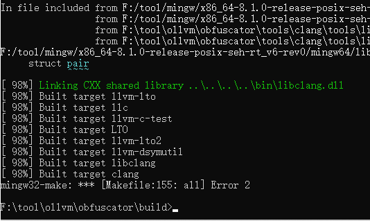
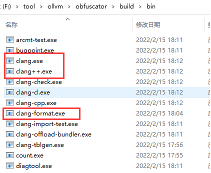
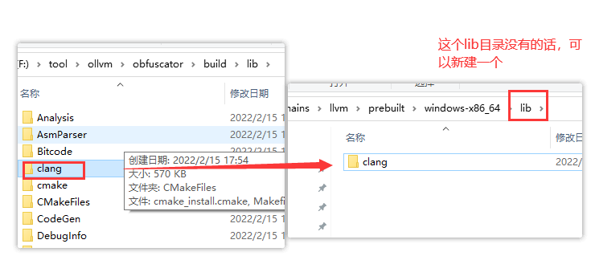
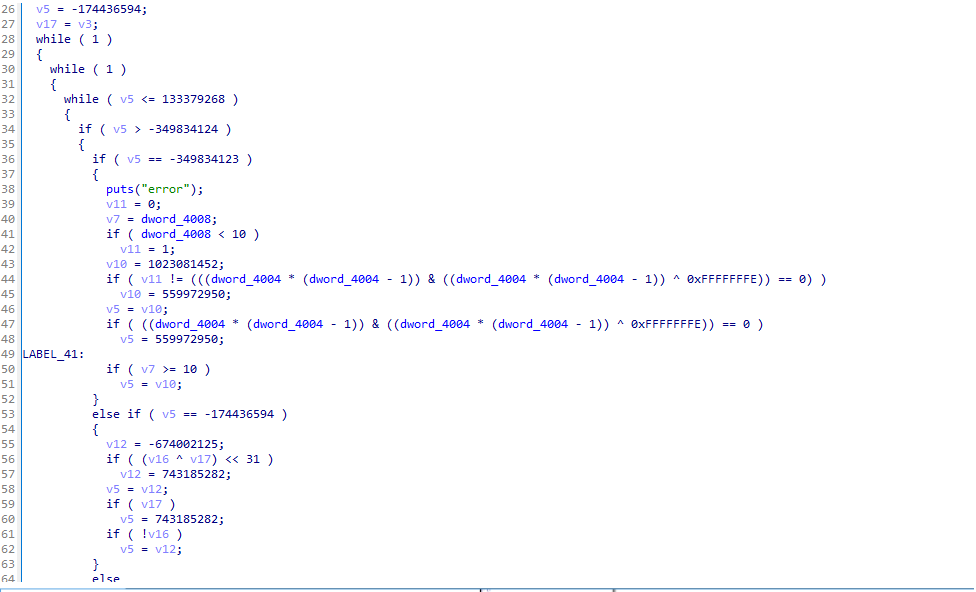
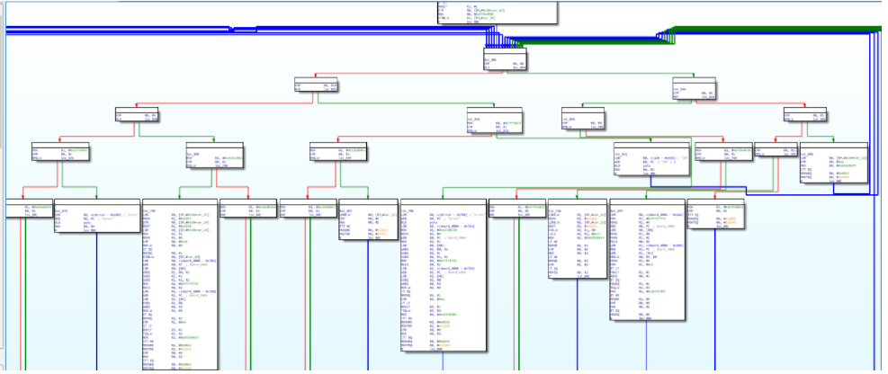

# 简介
# 编译
## WSL编译
```
git clone -b llvm-4.0 --depth=1 https://github.com/obfuscator-llvm/obfuscator.git
cd obfuscator
mkdir build
cd build
cmake -DCMAKE_BUILD_TYPE=Release -DLLVM_INCLUDE_TESTS=OFF ../
make -j7
```
## Window编译
这里为排除系统环境变量干扰，需要先清洗下\
执行如下命令，重新设置PATH
```
set PATH=%DEF_PATH%;F:\tool\mingw\x86_64-8.1.0-release-posix-seh-rt_v6-rev0\mingw64\bin;H:\Program Files\CMake\bin\;
```
> DEF_PATH即系统默认的配置，具体参考[/window/cmd.md](/window/cmd.md) \
> 另外自然是mingw和cmake配置了\
> MinGW下载地址[https://github.com/Humenger/tool/releases/tag/MinGW](https://github.com/Humenger/tool/releases/tag/MinGW)

然后在当前窗口中执行如下命令
```
git clone -b llvm-4.0 --depth=1 https://github.com/obfuscator-llvm/obfuscator.git
cd obfuscator
mkdir build
cd build
cmake -G "MinGW Makefiles" -DCMAKE_BUILD_TYPE=Release -DLLVM_INCLUDE_TESTS=OFF ../
mingw32-make -j16
```
最后编译结果 \
\


> 虽然没有构建完成，但关键的clang.exe,clang++.exe,clang-format.exe都已经构建出来了
# 使用
- 将上面三个文件复制到`{ndk path}\toolchains\llvm\prebuilt\windows-x86_64\bin\`目录下，覆盖原有文件（想保险的，也可以把原有文件先备份下）
> 我这里用的ndk版本是16.1.4479499
- 再将`build/include/clang/`目录复制到`{ndk path}\toolchains\llvm\prebuilt\windows-x86_64\lib\` \

> lib目录若不存在，可能只有一个lib64，需要先新建个lib目录
- 然后下载[/llvm/ollvm/demo/hello001](/llvm/ollvm/demo/hello001) 这个demo
- 然后在该demo根目录下打开cmd窗口，并像上面一样配置环境变量，只保留DEF_PATH和ndk所在目录
- 然后执行`ndk-build`，即可开始构建demo
- 构建完成后会在libs下输出相应二进制so文件
- 用IDA查看，即可看到被混淆了 \
 \


## 问题
- Could NOT find OCaml
> 暂时没看出什么影响
- Makefile:154: recipe for target 'all' failed
> 可以忽略，只要关键文件都构建出来即可
# 参考
- https://www.cnblogs.com/theseventhson/p/14861940.html
- https://bbs.pediy.com/thread-217727.htm
- https://www.anquanke.com/post/id/86384
- https://www.bilibili.com/read/cv13148974


